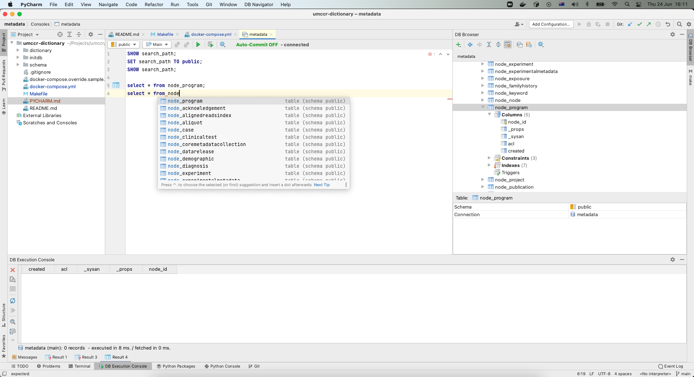
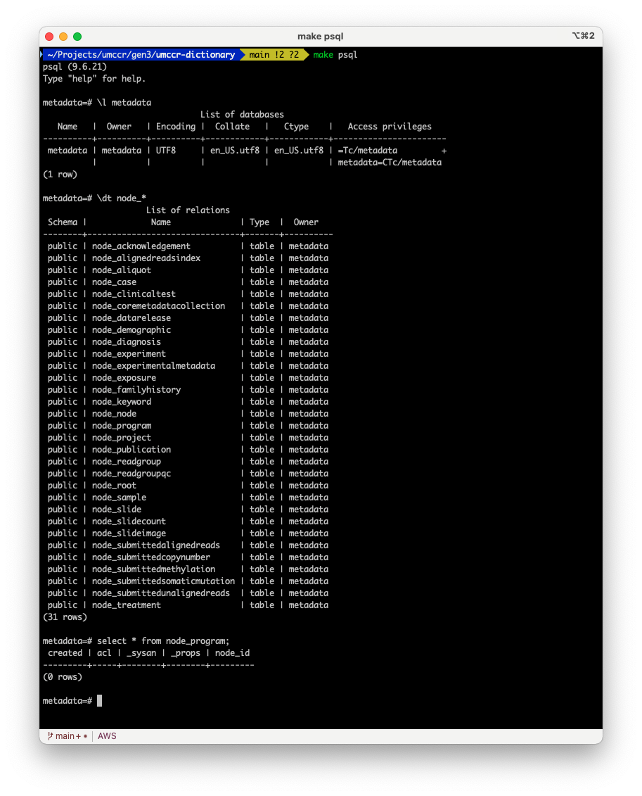

# UMCCR Data Dictionary

This repo contains Docker and Makefile based Data Dictionary Development workflow i.e., packaging around dictionary tools (Docker image) for conversion, visualisation, testing, validation to allow Data Modeller to iteratively develop schema locally. 

Our aim is to develop **UMCCR Data Dictionary** for Gen3 platform. 

## Development

- Required:
  - [Docker Desktop](https://www.docker.com/products/docker-desktop)
  - [GNU Make](https://www.gnu.org/software/make/)
    - GNU Make comes with most Linux and macOS Xcode
    - Try `make --version` to see whether you already have it in   
    - Otherwise `brew install make` for macOS and try like `gmake --version`
    - On Ubuntu, try `apt-get install make`
    - If `make` is not possible then you will need to execute each target in [Makefile](Makefile)

## Workflow

### Basic

- Bring up the stack
```
make up
```

- Check the stack
```
make ps
```

- Restart the stack 
```
make restart
```

- Bring it down 
```
make down
```

### Visualising Dictionary

- Visit to: http://localhost:8080
- You can switch dictionary as follows:
  - `http://localhost:8080/#schema/<dictionary_name>.json` e.g.
  - http://localhost:8080/#schema/anvil.json
  - http://localhost:8080/#schema/dcf.json 
  - http://localhost:8080/#schema/gdc.json 
  - http://localhost:8080/#schema/kf.json

> DEBUG: To debug visualisation, try with Browser built-in developer tools (e.g., [here](https://balsamiq.com/support/faqs/browserconsole/) and [here](https://developer.chrome.com/docs/devtools/console/log/)). Typically, right click > inspect > select "console" tab > reload the page.

### Modifying Dictionary

- Say you are working on `umccr` dictionary
- Modify schema yaml files in `dictionary/umccr/`
- Convert into JSON
```
make umccr
```
- Visit to: http://localhost:8080/#schema/umccr.json
- Reload the page (_**do twice**_ if necessary)


### Testing Dictionary

- To test and validate dictionary:
```
make test dd=umccr
make test dd=kf
make test dd=gdc
make test dd=anvil
make test dd=dcf
```


### Loading Dictionary

- This will populate database tables into local PostgreSQL server; based on JSON Data Dictionary schema that you have designed from previous steps.

- To load the _minted_ JSON Data Dictionary to Gen3 Metadata Database tables e.g., say `umccr` dictionary

```
make load dd=umccr
```

- Get into PSQL console

```
make psql
```

- Once inside PSQL console, try like so:

```
metadata=> \l
metadata=> \dt
metadata=> \dt node_*
metadata=> \dt edge_*

metadata=> select * from node_program;
 created | acl | _sysan | _props | node_id
---------+-----+--------+--------+---------
(0 rows)

metadata=> select * from node_project;
 created | acl | _sysan | _props | node_id
---------+-----+--------+--------+---------
(0 rows)

metadata=> \q
```

#### Reset Public Schema

- The Data Dictionary is populated into [PostgreSQL Public schema](https://www.postgresql.org/docs/9.6/ddl-schemas.html)

- If you'd like to reset public schema, do like so:
```
make reset
```

- This will reset current `metadata` database; so that you can (re) load data dictionary again. Hence, for example:

```
make load dd=umccr
make psql
metadata=> \dt node_*
metadata=> \q

make reset

make load dd=anvil
make psql
metadata=> \dt node_*
metadata=> \q
```

#### Connection Info

- At this point, you have a couple of options to work with local PostgreSQL database. Use connection info as follows:
```
Host: localhost
Port: 5432
Database: metadata
Username: metadata
Password: metadata
```

- For sa (System Admin) account; use these instead:
```
Host: localhost
Port: 5432
Username: postgres
Password: postgres
```

#### Database Tooling

- Try the following for some GUI-based IDE tooling:
  - Setup [PyCharm Community Edition](PYCHARM.md)
  - [SQL Developer](https://www.oracle.com/tools/downloads/sqldev-downloads.html) (freeware)

**Screenshot:** _PyCharm_
<details>
  <summary>Click to expand!</summary>

  
</details>

**Screenshot:** _PSQL Console_
<details>
  <summary>Click to expand!</summary>

  
</details>
